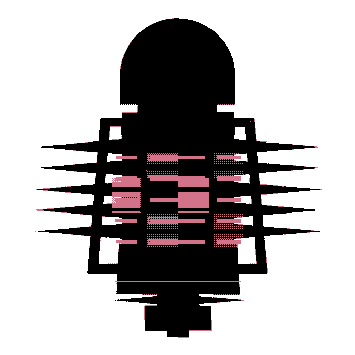

<table align="center" style="margin: 0 auto; border-collapse: collapse; width: 100%; border: none;">
  <tr style="border: none;">
    <td style="border: none; padding: 0;">
      
    </td>
    <td style="border: none; padding: 0; text-align: center;">
      
    </td>
    <td style="border: none; padding: 0;">
      
    </td>
  </tr>
</table>

<table align="center" ">
  <tr>
    <td width="800px">
      <h3 align="center">
        <samp> I'm Leonardo Pereira Ramos
                <b></b>
          but you can also call me Léo.
        </samp>
      </h3>
      <h3 align="center">
        <samp> I'm studying
                <b></b>
         Information Systems college (Unasp-HT).
        </samp>
             
      </h3>
    </td>
  </tr>
  <tr>
    <td align="center">
      
      
    </td>
  </tr>
</table>

 

 # I'm  listening...
 

  
  
    
  
  

 
<table align="center">
  <tr>
    <th colspan="2"><h3>I'm studying</h3></th>
  </tr>
  <tr>
    <td align="center">
      &nbsp;
      &nbsp;
      &nbsp;
      &nbsp;
      &nbsp;
      &nbsp;
      &nbsp;
      &nbsp;
      &nbsp;
      
    </td>
  </tr>
</table>

  
 

